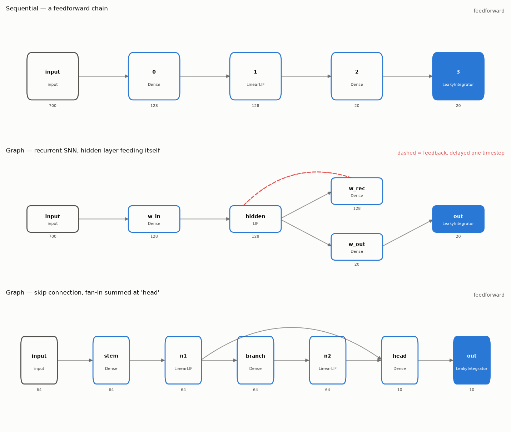
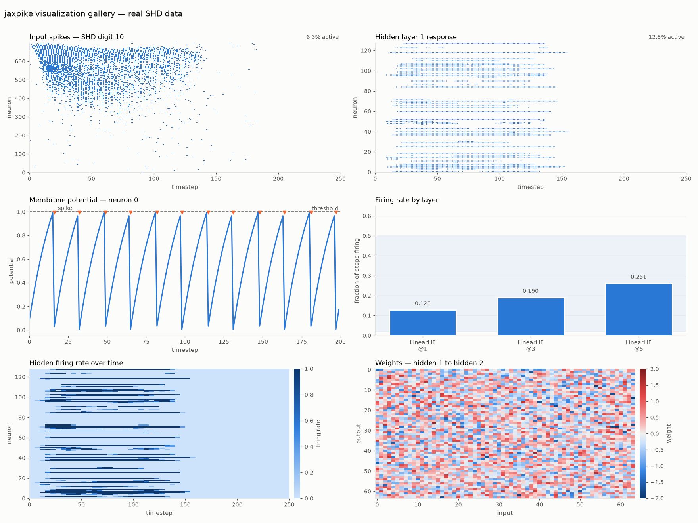
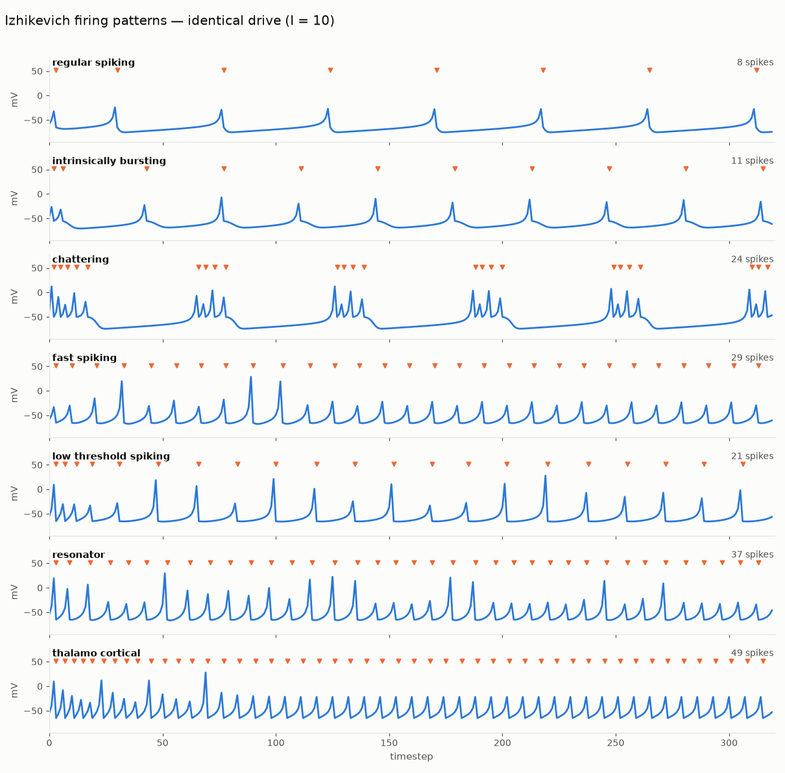
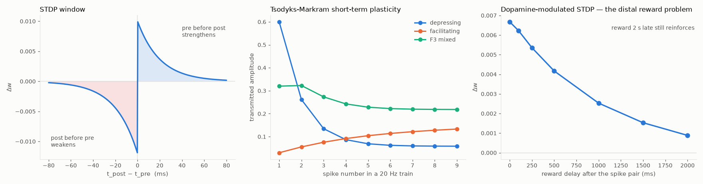

# jaxpike

Fast, flexible spiking neural networks in JAX.

> **Status: pre-alpha.** Working library with a real result: **67.6% on Spiking Heidelberg
> Digits**, against the ~48% published feedforward baseline, trained in under two minutes on
> an NVIDIA T4. Parallel-in-time execution makes training **~2.5× faster end to end**
> (17–21× on the isolated forward/backward pass) with bit-identical spike trains, and
> rematerialization cuts BPTT memory **67×**. Everything is reproducible from
> [`benchmarks/`](benchmarks/) and [`examples/`](examples/), including the cases where we
> lose. Parallel-in-time requires reset-free neurons (`LinearLIF`); the general reset case is
> measured, unsolved, and [written up](benchmarks/README.md). See [PLAN.md](PLAN.md).

## Why another SNN library

The neuromorphic community frames this field as one tradeoff: **speed versus flexibility.**
Frameworks with hand-written CUDA kernels are the fastest available but only support the
neuron models someone already wrote a kernel for. Frameworks in pure PyTorch or JAX let you
write any neuron you like and run considerably slower.

jaxpike exists because that tradeoff is an artifact of kernels being written *by hand*. If a
neuron model is **compiled** into a fused kernel instead, you get both. That is the
project's central bet, and everything else follows from it:

- **Compiled neurons.** Write a neuron as an ordinary JAX function; get a fused kernel and
  its custom VJP generated for you, with a clear diagnostic and a correct fallback when your
  model falls outside the compilable subset.
- **Memory that doesn't scale with time.** Every framework today stores membrane state for
  all `T` timesteps to support BPTT, at `O(T·B·N)`. Fusing the recurrence and recomputing in
  the backward pass makes the working set `O(B·N)`.
- **Leaping over time, not stepping through it.** Named for saltatory conduction: myelinated
  axons don't regenerate the action potential at every point along the membrane, which is why
  they conduct at 150 m/s instead of 10. Same idea — parallel scan within a chunk, state
  regenerated only at checkpoints.
- **Learning rules as a first-class axis.** BPTT is the default, not the only option. e-prop,
  OTTT, SLTT and forward-mode alternatives against the same model definition.
- **Portable.** One kernel source targeting both NVIDIA GPUs and TPUs, via Pallas.
- **Interoperable.** NIR import and export, so models move between jaxpike, Norse, snnTorch,
  Loihi, SpiNNaker2 and Speck.

## Install

```bash
pip install -e ".[dev]"     # from a checkout; not yet on PyPI
```

## Quick start

```python
import jax
import jax.numpy as jnp
import jaxpike as jp

key = jax.random.key(0)
k1, k2 = jax.random.split(key)

net = jp.Sequential(
    jp.Dense(784, 512, key=k1),
    jp.LIF(tau=20.0),  # tau is learnable by default
    jp.Dense(512, 10, key=k2),
    jp.LIF(tau=20.0, surrogate=jp.ATan()),
)

xs = jax.random.uniform(key, (100, 32, 784))  # (time, batch, features)
spikes, final_state = jp.unroll(net, xs)
logits = jp.spike_rate(spikes)  # rate-coded readout
```

State is explicit and functional, so long sequences stream in chunks and truncated BPTT
comes for free:

```python
spikes_a, state = jp.unroll(net, xs[:50])
spikes_b, state = jp.unroll(net, xs[50:], state)  # exactly equals the unchunked run
```

## Arbitrary topologies

`Sequential` is a straight chain. `Graph` wires any layer to any other — recurrence, skip
connections, branching, fan-in — and does not ask whether the result is sensible.

```python
net = jp.Graph(
    nodes={
        "w_in":   jp.Dense(700, 128, key=k1),
        "hidden": jp.LIF(tau=20.0),
        "w_rec":  jp.Dense(128, 128, key=k2),      # hidden feeding itself
        "w_out":  jp.Dense(128, 20, key=k3),
        "out":    jp.LeakyIntegrator(tau=20.0),
    },
    edges=[
        ("input", "w_in"), ("w_in", "hidden"),
        ("hidden", "w_rec"), ("w_rec", "hidden"),   # the cycle
        ("hidden", "w_out"), ("w_out", "out"),
    ],
    output="out",
)

viz.architecture(net, input_shape=(1, 700))
```



Two rules make any wiring well-defined, and they are the only two. **A node with several
incoming edges sums them**, which is what a synapse does and what makes fan-in and skip
connections work without special syntax. **An edge that closes a cycle reads the previous
timestep**, because a cycle cannot be resolved within one step — that is what makes a
recurrent SNN recurrent, and `Graph` finds those back-edges for you.

Because recurrence is a genuine cycle in time, a recurrent `Graph` cannot run
parallel-in-time and says so rather than quietly computing something else.

## Spiking convnets

Layout is NHWC — `(time, batch, height, width, channels)` — because XLA's convolutions are
written for channels-last and NCHW forces a transpose around every op.

```python
gain = jp.lif_gain(tau=20.0)  # see below; deep SNNs go silent without it

net = jp.Sequential(
    jp.Conv2d(2, 32, 3, key=k1, gain=gain),  # 2 channels: DVS on/off events
    jp.LinearLIF(tau=20.0, threshold=0.2),
    jp.Pool2d(2),
    jp.Conv2d(32, 64, 3, key=k2, gain=gain),
    jp.LinearLIF(tau=20.0, threshold=0.2),
    jp.Pool2d(2),
    jp.Flatten(),
    jp.Dense(64 * 8 * 8, 10, key=k3, gain=gain),
    jp.LinearLIF(tau=20.0, threshold=0.2),
)
```

Convolution and pooling are stateless and applied per timestep, so a spiking convnet runs
through `unroll_parallel` end to end.

## Why deep SNNs go silent, and the one line that fixes it

Deep spiking networks have a failure mode ANNs don't: activity decays multiplicatively with
depth until nothing reaches the output, and a silent network has no gradient anywhere to
recover from. Measured here, a three-layer spiking convnet with standard LeCun init:

| | layer 1 | layer 2 | layer 3 |
|---|---:|---:|---:|
| plain LeCun init | 0.045 | **0.000** | **0.000** |
| with `gain=lif_gain(tau)` | 0.380 | 0.327 | 0.200 |

The cause is that a LIF membrane is an exponential moving average, which attenuates signal
standard deviation by `sqrt((1-a)/(1+a))` — a factor of 6.3 at `tau=20`. Weights initialized
for unit-variance activations therefore produce membranes six times smaller than intended,
sitting well below threshold. `jp.lif_gain(tau)` returns exactly the compensating factor.

## Defining a neuron

Any module following the state contract works. Nothing is registered, subclassed, or
special-cased:

```python
init_state(input_shape) -> state pytree
out_shape(input_shape)  -> output shape
__call__(state, x)      -> (new_state, spikes)
```

## Defining a surrogate gradient

Write the smooth relaxation; the gradient comes from autodiff. There is no custom VJP to get
wrong, and because the derivative is autodiff-consistent it can be finite-difference tested:

```python
class MySurrogate(jp.Surrogate):
    slope: float = 10.0

    def relaxation(self, v):
        return jax.nn.sigmoid(self.slope * v)
```

## Visualization



*Real Spiking Heidelberg Digits data. Regenerate with `PYTHONPATH=. python examples/gallery.py`;
every figure is also rendered for dark mode.*

```python
from jaxpike import viz

viz.raster(spikes)  # the canonical SNN plot
viz.membrane(voltages, spikes=spikes, threshold=1.0)
viz.layer_rates_from(net, xs)  # is my network silent?
viz.rate_heatmap(spikes)
viz.weights(net.layers[0].weight)
```

Every function takes an optional `ax` and returns it, so plots compose into larger figures.
`viz.Theme.dark()` switches to a dark surface with its own selected colour steps rather than
an inverted light palette.

The seven Izhikevich firing patterns under identical drive:



And the plasticity mechanisms — the STDP window, short-term depression versus facilitation,
and reward arriving seconds after the spike pair that earned it:



`layer_rates_from` is the one to reach for first. Deep SNNs fail by activity decaying with
depth until the output never fires, and a silent network has no gradient anywhere to recover
from — this plots the firing rate after every spiking layer and labels any that have gone
silent or saturated.

## Hardware export via NIR

[NIR](https://github.com/neuromorphs/NIR) is the field's interchange format — ONNX for
spiking networks. Exporting to it lets a model trained here run in snnTorch, Norse, Spyx,
Lava, Rockpool or Nengo, and deploy to Intel Loihi, SpiNNaker2, BrainScaleS-2, SynSense Speck
or Xylo.

```python
from jaxpike import nir

nir.save(net, "model.nir", input_shape=(1, 700), dt_seconds=1e-3)
net = nir.load("model.nir")  # exact round trip, including convnets
```

Three things worth knowing, all verified rather than assumed:

**Units are not standardized by NIR.** It stores `tau` in seconds; our neurons store it in
timesteps. `dt_seconds` declares what one of your timesteps physically means, and getting it
wrong rescales every time constant in the model.

**Some models cannot be exported, and those raise rather than silently changing.**
`reset="subtract"` has no NIR equivalent (NIR resets to a fixed value); so do max pooling,
adaptive thresholds, Izhikevich dynamics and short-term plasticity.

**Leaving the library is not bit-exact.** NIR specifies a differential equation, not a
discretization — we solve it exactly, Norse uses forward Euler. snnTorch imports our graphs
but assumes `dt = 1e-4 s` regardless of the file and has no mapping for NIR's `LI` node, so a
`LeakyIntegrator` readout will not cross into it. Check numerically on the far side.

## Development

```bash
uv venv && uv pip install -e ".[dev]"
.venv/bin/pytest              # CPU, fast
.venv/bin/ruff check . && .venv/bin/ruff format --check .
```

Kernel and benchmark work requires NVIDIA or TPU hardware — JAX's Metal backend cannot run
Pallas, so those are remote-only. See §3 of [PLAN.md](PLAN.md).

## License

Apache-2.0.
